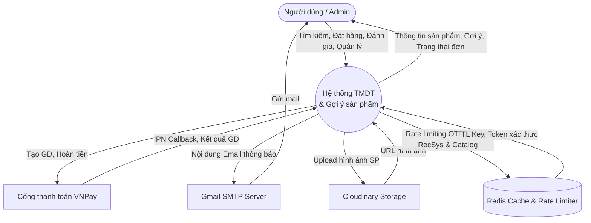

# DFD Level 0

Sơ đồ luồng dữ liệu mức đỉnh (Context Diagram) mô tả các tương tác giữa người dùng (khách, user, admin) và hệ thống với các dịch vụ bên ngoài (cổng thanh toán, email, lưu trữ).

```mermaid
graph TD
    User([Người dùng / Admin])
    System((Hệ thống TMĐT\n& Gợi ý sản phẩm))
    
    VNPay[Cổng thanh toán VNPay]
    Gmail[Gmail SMTP Server]
    Cloudinary[Cloudinary Storage]
    Redis[(Redis Cache & Rate Limiter)]

    User -- "Tìm kiếm, Đặt hàng, Đánh giá, Quản lý" --> System
    System -- "Thông tin sản phẩm, Gợi ý, Trạng thái đơn" --> User
    
    System -- "Tạo GD, Hoàn tiền" --> VNPay
    VNPay -- "IPN Callback, Kết quả GD" --> System
    
    System -- "Nội dung Email thông báo" --> Gmail
    Gmail -- "Gửi mail" --> User
    
    System -- "Upload hình ảnh SP" --> Cloudinary
    Cloudinary -- "URL hình ảnh" --> System
    
    System -- "Rate limiting OTP, Cache RecSys & Catalog" --> Redis
    Redis -- "TTL Key, Token xác thực" --> System
```
