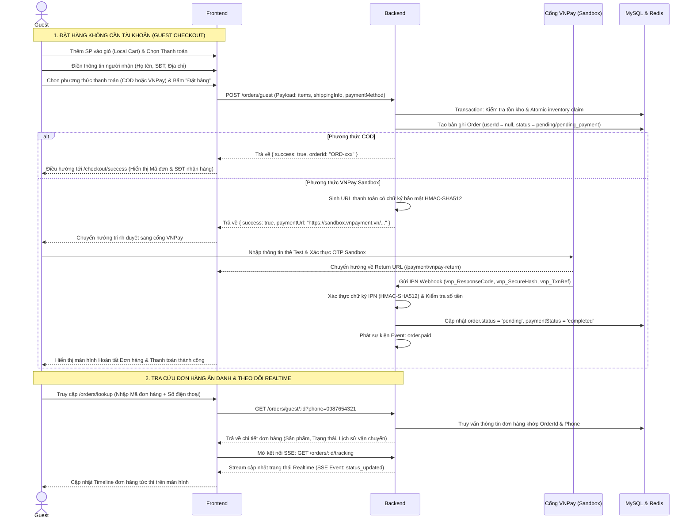

# Sơ đồ tuần tự: Luồng Đặt hàng Khách vãng lai (Guest Checkout) & Tra cứu đơn

```mermaid
sequenceDiagram
    actor Guest
    participant Frontend
    participant Backend
    participant VNPay as Cổng VNPay (Sandbox)
    participant Database as MySQL & Redis

    Note over Guest, Frontend: 1. ĐẶT HÀNG KHÔNG CẦN TÀI KHOẢN (GUEST CHECKOUT)
    Guest->>Frontend: Thêm SP vào giỏ (Local Cart) & Chọn Thanh toán
    Guest->>Frontend: Điền thông tin người nhận (Họ tên, SĐT, Địa chỉ)
    Guest->>Frontend: Chọn phương thức thanh toán (COD hoặc VNPay) & Bấm "Đặt hàng"
    Frontend->>Backend: POST /orders/guest (Payload: items, shippingInfo, paymentMethod)

    Backend->>Database: Transaction: Kiểm tra tồn kho & Atomic inventory claim
    Backend->>Database: Tạo bản ghi Order (userId = null, status = pending/pending_payment)

    alt Phương thức COD
        Backend-->>Frontend: Trả về { success: true, orderId: "ORD-xxx" }
        Frontend-->>Guest: Điều hướng tới /checkout/success (Hiển thị Mã đơn & SĐT nhận hàng)
    else Phương thức VNPay Sandbox
        Backend->>Backend: Sinh URL thanh toán có chữ ký bảo mật HMAC-SHA512
        Backend-->>Frontend: Trả về { success: true, paymentUrl: "https://sandbox.vnpayment.vn/..." }
        Frontend-->>Guest: Chuyển hướng trình duyệt sang cổng VNPay
        Guest->>VNPay: Nhập thông tin thẻ Test & Xác thực OTP Sandbox
        VNPay-->>Frontend: Chuyển hướng về Return URL (/payment/vnpay-return)
        VNPay->>Backend: Gửi IPN Webhook (vnp_ResponseCode, vnp_SecureHash, vnp_TxnRef)
        Backend->>Backend: Xác thực chữ ký IPN (HMAC-SHA512) & Kiểm tra số tiền
        Backend->>Database: Cập nhật order.status = 'pending', paymentStatus = 'completed'
        Backend->>Backend: Phát sự kiện Event: order.paid
        Frontend-->>Guest: Hiển thị màn hình Hoàn tất Đơn hàng & Thanh toán thành công
    end

    Note over Guest, Backend: 2. TRA CỨU ĐƠN HÀNG ẨN DANH & THEO DÕI REALTIME
    Guest->>Frontend: Truy cập /orders/lookup (Nhập Mã đơn hàng + Số điện thoại)
    Frontend->>Backend: GET /orders/guest/:id?phone=0987654321
    Backend->>Database: Truy vấn thông tin đơn hàng khớp OrderId & Phone
    Backend-->>Frontend: Trả về chi tiết đơn hàng (Sản phẩm, Trạng thái, Lịch sử vận chuyển)
    Frontend->>Backend: Mở kết nối SSE: GET /orders/:id/tracking
    Backend-->>Frontend: Stream cập nhật trạng thái Realtime (SSE Event: status_updated)
    Frontend-->>Guest: Cập nhật Timeline đơn hàng tức thì trên màn hình
```
