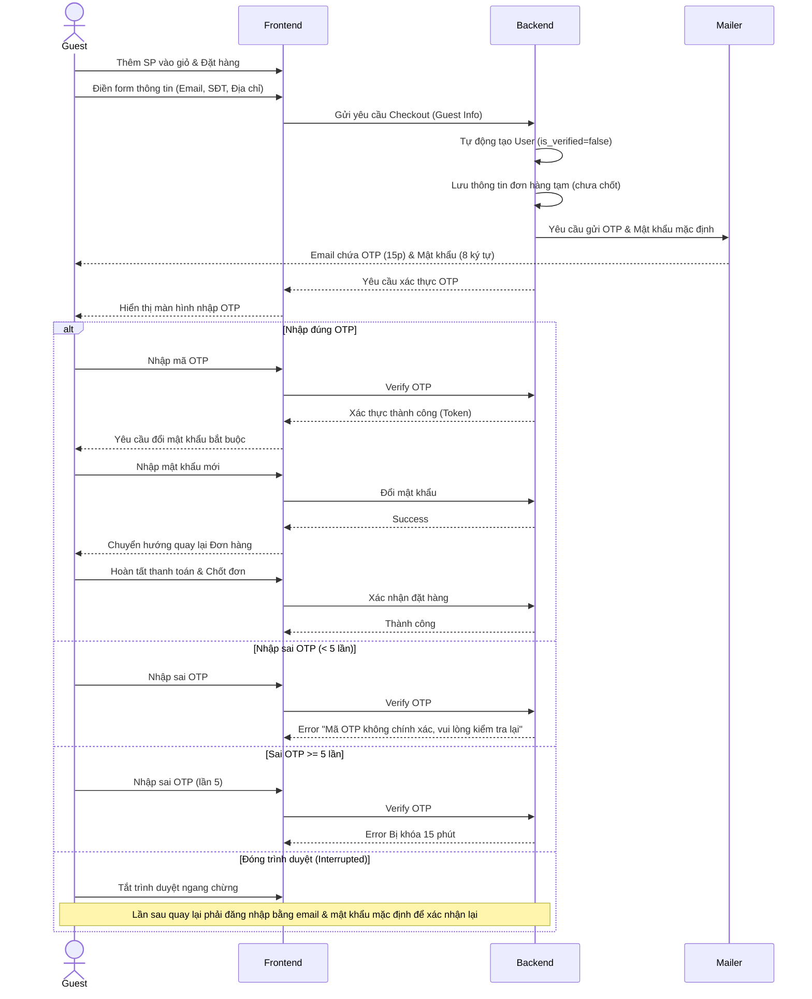

# Sơ đồ tuần tự: Luồng Guest Checkout & Xác thực OTP

```mermaid
sequenceDiagram
    actor Guest
    participant Frontend
    participant Backend
    participant Mailer
    
    Guest->>Frontend: Thêm SP vào giỏ & Đặt hàng
    Guest->>Frontend: Điền form thông tin (Email, SĐT, Địa chỉ)
    Frontend->>Backend: Gửi yêu cầu Checkout (Guest Info)
    Backend->>Backend: Tự động tạo User (is_verified=false)
    Backend->>Backend: Lưu thông tin đơn hàng tạm (chưa chốt)
    Backend->>Mailer: Yêu cầu gửi OTP & Mật khẩu mặc định
    Mailer-->>Guest: Email chứa OTP (15p) & Mật khẩu (8 ký tự)
    Backend-->>Frontend: Yêu cầu xác thực OTP
    Frontend-->>Guest: Hiển thị màn hình nhập OTP
    
    alt Nhập đúng OTP
        Guest->>Frontend: Nhập mã OTP
        Frontend->>Backend: Verify OTP
        Backend-->>Frontend: Xác thực thành công (Token)
        Frontend-->>Guest: Yêu cầu đổi mật khẩu bắt buộc
        Guest->>Frontend: Nhập mật khẩu mới
        Frontend->>Backend: Đổi mật khẩu
        Backend-->>Frontend: Success
        Frontend-->>Guest: Chuyển hướng quay lại Đơn hàng
        Guest->>Frontend: Hoàn tất thanh toán & Chốt đơn
        Frontend->>Backend: Xác nhận đặt hàng
        Backend-->>Frontend: Thành công
    else Nhập sai OTP (< 5 lần)
        Guest->>Frontend: Nhập sai OTP
        Frontend->>Backend: Verify OTP
        Backend-->>Frontend: Error "Mã OTP không chính xác, vui lòng kiểm tra lại"
    else Sai OTP >= 5 lần
        Guest->>Frontend: Nhập sai OTP (lần 5)
        Frontend->>Backend: Verify OTP
        Backend-->>Frontend: Error Bị khóa 15 phút
    else Đóng trình duyệt (Interrupted)
        Guest->>Frontend: Tắt trình duyệt ngang chừng
        Note over Guest, Backend: Lần sau quay lại phải đăng nhập bằng email & mật khẩu mặc định để xác nhận lại
    end
```
