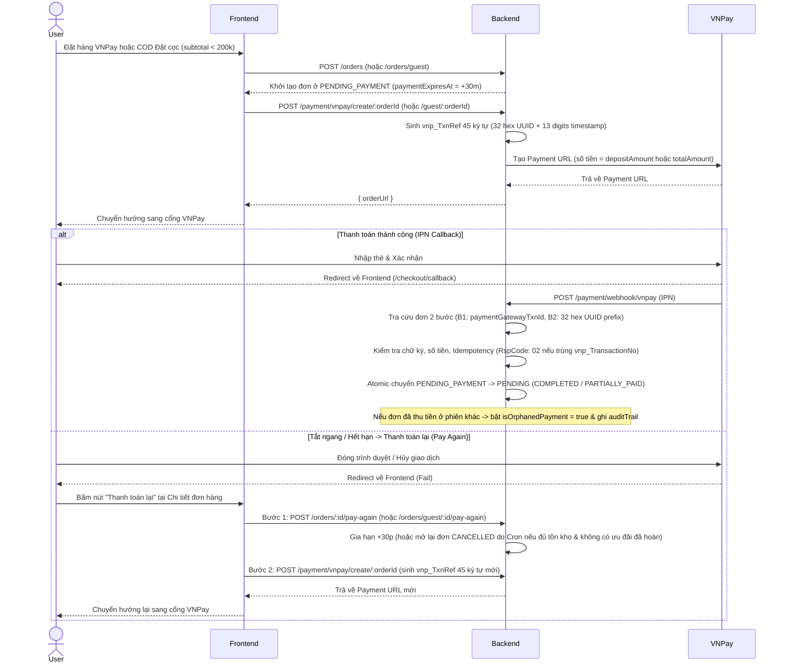

# Sơ đồ tuần tự: Luồng Thanh toán VNPay, Thanh Toán Lại (Repay) & Đối Soát IPN 2 Chiều

```mermaid
sequenceDiagram
    actor User
    participant Frontend
    participant Backend
    participant VNPay
    
    User->>Frontend: Đặt hàng VNPay hoặc COD Đặt cọc (subtotal < 200k)
    Frontend->>Backend: POST /orders (hoặc /orders/guest)
    Backend-->>Frontend: Khởi tạo đơn ở PENDING_PAYMENT (paymentExpiresAt = +30m)
    Frontend->>Backend: POST /payment/vnpay/create/:orderId (hoặc /guest/:orderId)
    Backend->>Backend: Sinh vnp_TxnRef 45 ký tự (32 hex UUID + 13 digits timestamp)
    Backend->>VNPay: Tạo Payment URL (số tiền = depositAmount hoặc totalAmount)
    VNPay-->>Backend: Trả về Payment URL
    Backend-->>Frontend: { orderUrl }
    Frontend-->>User: Chuyển hướng sang cổng VNPay
    
    alt Thanh toán thành công (IPN Callback)
        User->>VNPay: Nhập thẻ & Xác nhận
        VNPay-->>User: Redirect về Frontend (/checkout/callback)
        VNPay->>Backend: POST /payment/webhook/vnpay (IPN)
        Backend->>Backend: Tra cứu đơn 2 bước (B1: paymentGatewayTxnId, B2: 32 hex UUID prefix)
        Backend->>Backend: Kiểm tra chữ ký, số tiền, Idempotency (RspCode: 02 nếu trùng vnp_TransactionNo)
        Backend->>Backend: Atomic chuyển PENDING_PAYMENT -> PENDING (COMPLETED / PARTIALLY_PAID)
        Note over Backend: Nếu đơn đã thu tiền ở phiên khác -> bật isOrphanedPayment = true & ghi auditTrail
    else Tắt ngang / Hết hạn -> Thanh toán lại (Pay Again)
        User->>VNPay: Đóng trình duyệt / Hủy giao dịch
        VNPay-->>User: Redirect về Frontend (Fail)
        User->>Frontend: Bấm nút "Thanh toán lại" tại Chi tiết đơn hàng
        Frontend->>Backend: Bước 1: POST /orders/:id/pay-again (hoặc /orders/guest/:id/pay-again)
        Backend->>Backend: Gia hạn +30p (hoặc mở lại đơn CANCELLED do Cron nếu đủ tồn kho & không có ưu đãi đã hoàn)
        Frontend->>Backend: Bước 2: POST /payment/vnpay/create/:orderId (sinh vnp_TxnRef 45 ký tự mới)
        Backend-->>Frontend: Trả về Payment URL mới
        Frontend-->>User: Chuyển hướng lại sang cổng VNPay
    end
```
