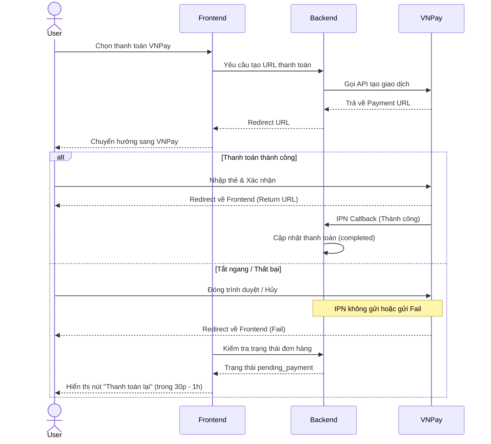

# Sơ đồ tuần tự: Luồng Thanh toán VNPay (IPN Callback & Edge Cases)

```mermaid
sequenceDiagram
    actor User
    participant Frontend
    participant Backend
    participant VNPay
    
    User->>Frontend: Chọn thanh toán VNPay
    Frontend->>Backend: Yêu cầu tạo URL thanh toán
    Backend->>VNPay: Gọi API tạo giao dịch
    VNPay-->>Backend: Trả về Payment URL
    Backend-->>Frontend: Redirect URL
    Frontend-->>User: Chuyển hướng sang VNPay
    
    alt Thanh toán thành công
        User->>VNPay: Nhập thẻ & Xác nhận
        VNPay-->>User: Redirect về Frontend (Return URL)
        VNPay->>Backend: IPN Callback (Thành công)
        Backend->>Backend: Cập nhật thanh toán (completed)
    else Tắt ngang / Thất bại
        User->>VNPay: Đóng trình duyệt / Hủy
        Note over VNPay, Backend: IPN không gửi hoặc gửi Fail
        VNPay-->>User: Redirect về Frontend (Fail)
        Frontend->>Backend: Kiểm tra trạng thái đơn hàng
        Backend-->>Frontend: Trạng thái pending_payment
        Frontend-->>User: Hiển thị nút "Thanh toán lại" (trong 30p - 1h)
    end
```
