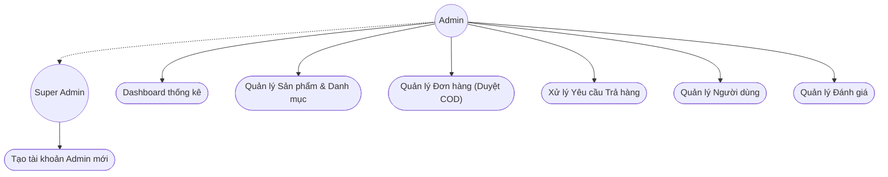

# Use Case - Admin

Sơ đồ Use Case thể hiện các chức năng quản trị hệ thống dành cho Admin và Super Admin.

```mermaid
flowchart TD
    Admin(("Admin"))
    SAdmin(("Super Admin"))

    Admin -.-> SAdmin

    UC1(["Dashboard thống kê"])
    UC2(["Quản lý Sản phẩm & Danh mục"])
    UC3(["Quản lý Đơn hàng (Duyệt COD)"])
    UC4(["Xử lý Yêu cầu Trả hàng"])
    UC5(["Quản lý Người dùng"])
    UC6(["Quản lý Đánh giá"])
    UC7(["Tạo tài khoản Admin mới"])

    Admin --> UC1
    Admin --> UC2
    Admin --> UC3
    Admin --> UC4
    Admin --> UC5
    Admin --> UC6

    SAdmin --> UC7
```
