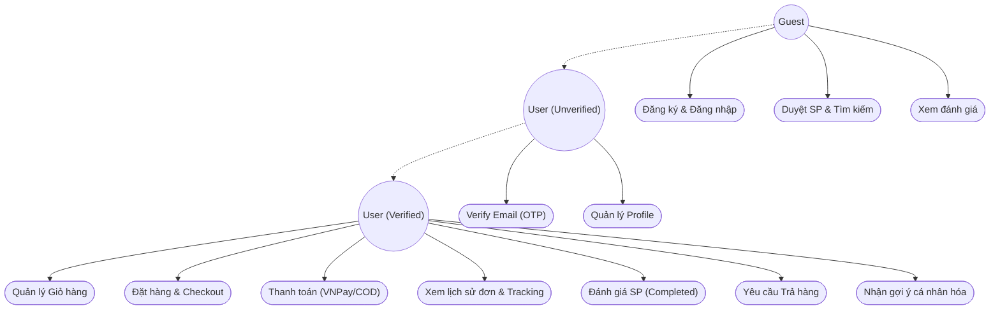

# Use Case - Guest & User

Sơ đồ Use Case thể hiện các chức năng mà Guest (Khách vãng lai), User (Người dùng chưa xác thực) và User (Người dùng đã xác thực) có thể thực hiện trên hệ thống.

```mermaid
flowchart TD
    Guest(("Guest"))
    UserUnv(("User (Unverified)"))
    UserVer(("User (Verified)"))

    Guest -.-> UserUnv
    UserUnv -.-> UserVer

    UC1(["Đăng ký & Đăng nhập"])
    UC2(["Duyệt SP & Tìm kiếm"])
    UC3(["Xem đánh giá"])
    UC4(["Verify Email (OTP)"])
    UC5(["Quản lý Profile"])
    UC6(["Quản lý Giỏ hàng"])
    UC7(["Đặt hàng & Checkout"])
    UC8(["Thanh toán (VNPay/COD)"])
    UC9(["Xem lịch sử đơn & Tracking"])
    UC10(["Đánh giá SP (Completed)"])
    UC11(["Yêu cầu Trả hàng"])
    UC12(["Nhận gợi ý cá nhân hóa"])

    Guest --> UC1
    Guest --> UC2
    Guest --> UC3

    UserUnv --> UC4
    UserUnv --> UC5

    UserVer --> UC6
    UserVer --> UC7
    UserVer --> UC8
    UserVer --> UC9
    UserVer --> UC10
    UserVer --> UC11
    UserVer --> UC12
```
